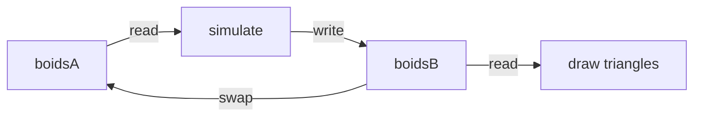

Capstone for the **Compute** track. You can already render a 3D scene ([Rotating Cube](/docs/rendering/rotating-cube)); this demo moves **simulation** to a compute shader and only uses the render pass to visualize results.

<WebGPUPlayground demo="boids" height={280} />

## 1. Data layout

Each boid is a struct in a storage buffer - position and velocity as `vec2f`:

```wgsl
struct Boid {
  pos: vec2f,
  vel: vec2f,
}
```

256 boids × 16 bytes = 4096 bytes per buffer.

## 2. Compute pass - flocking rules

Each thread updates one boid. Read neighbors from the **input** buffer, write to **output**:

```wgsl
@group(0) @binding(0) var<storage, read> input: array<Boid>;
@group(0) @binding(1) var<storage, read_write> output: array<Boid>;

@compute @workgroup_size(64)
fn main(@builtin(global_invocation_id) gid: vec3u) {
  let i = gid.x;
  if (i >= arrayLength(&input)) { return; }

  var b = input[i];
  var separation = vec2f(0.0);
  var alignment = vec2f(0.0);
  var alignCount = 0u;

  for (var j = 0u; j < arrayLength(&input); j++) {
    if (j == i) { continue; }
    let other = input[j];
    let delta = b.pos - other.pos;
    let dist = length(delta);
    if (dist < 0.12 && dist > 0.0001) {
      separation += delta / dist;
    }
    if (dist < 0.35) {
      alignment += other.vel;
      alignCount++;
    }
  }

  if (alignCount > 0u) { alignment /= f32(alignCount); }

  b.vel += separation * 0.0008 + alignment * 0.02;
  b.vel = normalize(b.vel) * 0.004;
  b.pos += b.vel;
  // wrap at edges...

  output[i] = b;
}
```

Dispatch with `ceil(boidCount / 64)` workgroups ([Compute](/docs/compute/compute)).

## 3. Ping-pong buffers

You cannot read and write the same storage buffer in one compute dispatch. Use two buffers and swap each frame:

```tsx
let readBuffer = bufferA;
let writeBuffer = bufferB;

// compute bind group: read → write
// render bind group: read from writeBuffer (latest state)

// after submit:
[readBuffer, writeBuffer] = [writeBuffer, readBuffer];
```



## 4. Render pass - instanced triangles

The vertex shader reads boid state from storage and places a small triangle per instance:

```wgsl
@group(0) @binding(0) var<storage, read> boids: array<Boid>;

@vertex
fn vs_main(
  @builtin(instance_index) i: u32,
  @builtin(vertex_index) vi: u32,
) -> VsOut {
  let tri = array(vec2f(0.0, 0.035), vec2f(-0.02, -0.02), vec2f(0.02, -0.02));
  let b = boids[i];
  let angle = atan2(b.vel.y, b.vel.x);
  let dir = vec2f(cos(angle), sin(angle));
  let pos = b.pos + rotate(tri[vi], dir);
  // ...
}
```

Draw with `pass.draw(3, BOID_COUNT)` - 3 vertices, one instance per boid ([Instancing](/docs/compute/instancing)).

## 5. Frame loop

Same pattern as rendering chapters:

```tsx
const encoder = device.createCommandEncoder();

const computePass = encoder.beginComputePass();
computePass.setPipeline(computePipeline);
computePass.setBindGroup(0, computeBindGroup);
computePass.dispatchWorkgroups(Math.ceil(BOID_COUNT / 64));
computePass.end();

const renderPass = encoder.beginRenderPass({ /* color attachment */ });
renderPass.setPipeline(renderPipeline);
renderPass.setBindGroup(0, renderBindGroup);
renderPass.draw(3, BOID_COUNT);
renderPass.end();

device.queue.submit([encoder.finish()]);
context.present();
```

## What you learned

- **Compute → render** split: simulation in `@compute`, visualization in `@vertex`/`@fragment`
- **Double buffering** avoids read/write hazards within one dispatch
- Storage buffers can be read in compute and read in render in the same frame (separate passes act as barriers)
- No RN-specific APIs - only WebGPU pipelines chained as [Compute](/docs/compute/compute) describes

Next: [Particles](/docs/compute/particles) - same architecture with additive blending and respawn logic.
