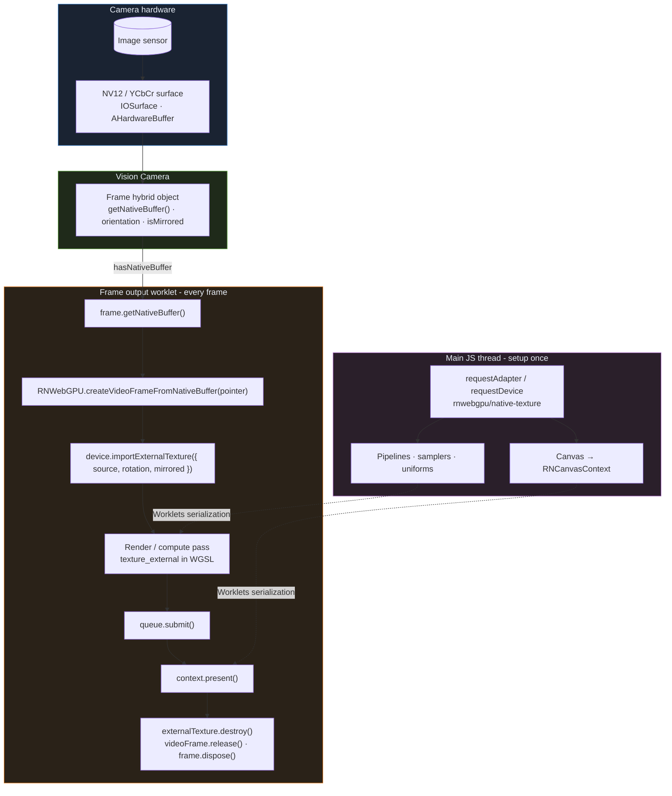

Run WGSL effects on live camera frames by importing each [Vision Camera `Frame`](https://visioncamera.margelo.com/api/react-native-vision-camera/hybrid-objects/Frame) as a `GPUExternalTexture`, sampling it in a shader, and presenting from the frame-output worklet.

<Callout type="info" title="Prerequisites">
This recipe builds on native texture import (`importExternalTexture`) and worklet runtimes. If those are new to you, read [Native APIs](/docs/getting-started/native-api) and [Worklets](/docs/integrations/worklets) first, and see [Native Extensions](/api/gpu-device-extensions) for the full import API.
</Callout>

Vision Camera owns the camera pipeline and exposes each captured image as a **`Frame` hybrid object** - a short-lived handle to GPU-shareable pixel data. React Native WebGPU sits on the consumer side: you take the frame's [`NativeBuffer`](https://visioncamera.margelo.com/api/react-native-vision-camera/interfaces/NativeBuffer), wrap it for Dawn, and sample it with `importExternalTexture`.

## Pipeline at a glance



<Callout type="info" title="Why two runtimes?">
GPU setup (device, pipelines, canvas context) usually happens on the **main JS thread**. Frame delivery runs on Vision Camera's **worklet runtime** - the same pattern as [Worklets](/docs/integrations/worklets). WebGPU objects are registered for Worklets serialization automatically; pass `GPUDevice` and `RNCanvasContext` into the callback.
</Callout>

## Vision Camera concepts

Before writing WGSL, understand what the `Frame` object gives you ([full API reference](https://visioncamera.margelo.com/api/react-native-vision-camera/hybrid-objects/Frame)):

| Concept | Why it matters for WebGPU |
| ------- | ------------------------- |
| [`hasNativeBuffer`](https://visioncamera.margelo.com/api/react-native-vision-camera/hybrid-objects/Frame#hasnativebuffer) | Zero-copy GPU path - skip CPU pixel downloads |
| [`getNativeBuffer()`](https://visioncamera.margelo.com/api/react-native-vision-camera/hybrid-objects/Frame#getnativebuffer) | Returns a [`NativeBuffer`](https://visioncamera.margelo.com/api/react-native-vision-camera/interfaces/NativeBuffer) with a native `pointer` (IOSurface / AHardwareBuffer) |
| [`orientation`](https://visioncamera.margelo.com/api/react-native-vision-camera/hybrid-objects/Frame#orientation) | Sensor rotation relative to your output - map to `importExternalTexture({ rotation })` |
| [`isMirrored`](https://visioncamera.margelo.com/api/react-native-vision-camera/hybrid-objects/Frame#ismirrored) | Front-camera horizontal flip - map to `importExternalTexture({ mirrored })` |
| [`pixelFormat: "native"`](https://visioncamera.margelo.com/api/react-native-vision-camera/hybrid-objects/Frame#pixelformat) | Request NV12-style surfaces via `useFrameOutput({ pixelFormat: "native" })` |
| [`dispose()`](https://visioncamera.margelo.com/api/react-native-vision-camera/hybrid-objects/Frame) | Release the frame back to the camera pool - call after GPU work finishes |

Vision Camera documents the WebGPU import path directly on [`Frame.getNativeBuffer()` - Examples](https://visioncamera.margelo.com/api/react-native-vision-camera/hybrid-objects/Frame#examples):

```tsx twoslash
import type { NativeVideoFrame } from "react-native-webgpu";
import type { NativeBuffer } from "react-native-vision-camera";
// importExternalTexture accepts our NativeVideoFrame as a frame source:
declare module "react-native-webgpu" {
  interface NativeVideoFrame extends VideoFrame {}
}
declare const device: GPUDevice;
declare const frame: {
  hasNativeBuffer: boolean;
  getNativeBuffer(): NativeBuffer;
  orientation: "up" | "down" | "left" | "right";
  isMirrored: boolean;
  dispose(): void;
};
// ---cut---
if (frame.hasNativeBuffer) {
  const nativeBuffer = frame.getNativeBuffer();
  const videoFrame = RNWebGPU.createVideoFrameFromNativeBuffer(nativeBuffer.pointer);
  const externalTexture = device.importExternalTexture({
    source: videoFrame,
    label: "camera-frame",
  });
  // After submitting commands that sample externalTexture:
  externalTexture.destroy();
  videoFrame.release();
  nativeBuffer.release();
}
```

React Native WebGPU extends that snippet with **`rotation`** and **`mirrored`** on `importExternalTexture` so Dawn uprights the sensor image before your shader runs - see [Native Extensions](/api/gpu-device-extensions#gpuexternaltexture-extensions).

## 1. Request the right device features

Camera frames need native surface import:

```tsx twoslash
import { Platform } from "react-native";
// ---cut---
const adapter = await navigator.gpu.requestAdapter();
const features: GPUFeatureName[] = [
  "rnwebgpu/native-texture" as GPUFeatureName,
  "dawn-multi-planar-formats" as GPUFeatureName,
];

// Android: opaque YCbCr path for camera AHardwareBuffer
if (Platform.OS === "android") {
  features.push("opaque-ycbcr-android-for-external-texture" as GPUFeatureName);
}

const device = await adapter!.requestDevice({ requiredFeatures: features });
```

Create the device on the **main thread** and pass it into the worklet - `device.lost` only fires on the main JS runtime ([Worklets](/docs/integrations/worklets)).

Feature-detect `"rnwebgpu/native-texture"` before importing - some emulators and Android drivers cannot import native surfaces. See [Native APIs](/docs/getting-started/native-api#native-textures).

## 2. Canvas + frame output

Use [`useFrameOutput`](https://visioncamera.margelo.com/) (Vision Camera v4+) with `pixelFormat: "native"` so each `Frame` carries a GPU-native buffer:

```tsx
import { Canvas, useCanvasRef } from "react-native-webgpu";
import { useFrameOutput } from "react-native-vision-camera";

const ref = useCanvasRef();
// Build pipeline, sampler, uniform buffers once on main thread…

const frameOutput = useFrameOutput({
  pixelFormat: "native",
  onFrame: (frame) => {
    "worklet";
    if (!frame.hasNativeBuffer) {
      frame.dispose();
      return;
    }
    renderCameraFrame(frame, device, context, pipeline);
  },
});
```

## 3. Per-frame import and render

Each frame is a new external texture - re-import every callback. Map Vision Camera metadata into Dawn's sampling transform:

```tsx twoslash
// @noImplicitAny: false
import type {} from "react-native-webgpu";
declare const encoder: GPUCommandEncoder;
// ---cut---
function renderCameraFrame(frame, device, context, pipeline) {
  "worklet";

  const nativeBuffer = frame.getNativeBuffer();
  try {
    const videoFrame = RNWebGPU.createVideoFrameFromNativeBuffer(
      nativeBuffer.pointer,
    );

    let rotation: 0 | 90 | 180 | 270 = 0;
    if (frame.orientation === "right") rotation = 90;
    else if (frame.orientation === "down") rotation = 180;
    else if (frame.orientation === "left") rotation = 270;

    const externalTex = device.importExternalTexture({
      source: videoFrame,
      rotation,
      mirrored: frame.isMirrored,
    });

    // encode render pass sampling texture_external …
    device.queue.submit([encoder.finish()]);
    context.present();
    externalTex.destroy();
    videoFrame.release();
  } finally {
    nativeBuffer.release();
    frame.dispose();
  }
}
```

Order matters: **submit → present → destroy → release**. Skipping [`release()`](https://visioncamera.margelo.com/api/react-native-vision-camera/interfaces/NativeBuffer#release) or [`frame.dispose()`](https://visioncamera.margelo.com/api/react-native-vision-camera/hybrid-objects/Frame) stalls the camera buffer pool.

## 4. WGSL - sample the camera

Bind the external texture and use `textureSampleBaseClampToEdge`:

```wgsl
@group(0) @binding(0) var srcTex: texture_external;
@group(0) @binding(1) var srcSampler: sampler;

@fragment
fn fs_main(@location(0) uv: vec2f) -> @location(0) vec4f {
  return cameraDecode(
    textureSampleBaseClampToEdge(srcTex, srcSampler, cameraCoord(uv)),
  );
}
```

Apply **cover-fit** scaling in uniforms so a landscape sensor fills a portrait canvas without stretching.

## 5. Android YUV decode

On iOS, NV12 → RGB happens in hardware. On Android, Dawn returns raw `[Y, Cb, Cr]` - decode in WGSL:

```wgsl
fn cameraDecode(c: vec4f) -> vec4f {
  let y  = c.r - 0.0627451;
  let cb = c.g - 0.5;
  let cr = c.b - 0.5;
  let r = 1.164384 * y + 1.792741 * cr;
  let g = 1.164384 * y - 0.213249 * cb - 0.532909 * cr;
  let b = 1.164384 * y + 2.112402 * cb;
  return vec4f(clamp(vec3f(r, g, b), vec3f(0.0), vec3f(1.0)), 1.0);
}
```

Also flip UVs on Android if the buffer origin differs from iOS (`cameraCoord` helper).

## Building effects

Once you have a sampled RGB frame, effects are ordinary shader math:

| Effect | Approach |
| ------ | -------- |
| Grayscale | Dot product with luminance weights |
| Chromatic aberration | Sample R/G/B at offset UVs |
| Blur | Downscale prepass → separable compute blur → composite |
| Vignette | Multiply by radial falloff from center |

Advanced pipelines run a **prepass** (external texture → rgba8 storage), then compute passes ping-pong between storage textures before the final full-screen draw.

## Further reading

- [Vision Camera - Frame](https://visioncamera.margelo.com/api/react-native-vision-camera/hybrid-objects/Frame) - hybrid object lifecycle and properties
- [Frame.getNativeBuffer() examples](https://visioncamera.margelo.com/api/react-native-vision-camera/hybrid-objects/Frame#examples) - Skia and **WebGPU** import snippets
- [NativeBuffer](https://visioncamera.margelo.com/api/react-native-vision-camera/interfaces/NativeBuffer) - shared contract for zero-copy GPU buffers
- [Native Extensions](/api/gpu-device-extensions) - `importExternalTexture` lifecycle on React Native
- [Worklets](/docs/integrations/worklets) - worklet runtimes and `installWebGPU()`

<Callout type="warn" title="Physical device required">
Camera access and native texture import require a real device - emulators are not sufficient for this recipe.
</Callout>

<Callout type="warn" title="Android YUV">
On Android you must apply YUV→RGB in WGSL when hardware conversion is unavailable. See [Native Extensions](/api/gpu-device-extensions) for platform notes.
</Callout>
